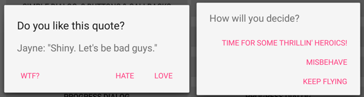

# StyledDialogs for Android

This library makes styling and using dialogs _a piece of cake_.

 

Features:

 - Compatible with Holo style and **Android Design Guidelines**
 - Change style for all dialogs only by changing a **few color resources**
 - Same look for **Android 2.2+**
 - **Same API** as native Android DialogFragments
 - `SimpleDialogFragment` class, which makes displaying simple dialogs a **one line of code**

## How to include it in your project:

With Maven:

	<dependency>
		<groupId>eu.inmite.android.lib</groupId>
		<artifactId>android-styled-dialogs</artifactId>
		<version>1.0.1</version>
		<type>apklib</type>
	</dependency>

Or:

 - clone the project
 - add it as library project in your IDE
 - include latest support library

## How to style all dialogs:

Add following into your application theme:

	<item name="sdlDialogStyle">@style/DialogStyleLight.Custom</item>

or

	<item name="sdlDialogStyle">@style/DialogStyleDark.Custom</item>

Define your dialog style, example for light theme:

	

## How to create simple dialogs:

Easy:

### Dialog with a simple message and Close button:

	SimpleDialogFragment.createBuilder(this, getSupportFragmentManager()).setMessage(R.string.message).show();

### Dialog with a title, message and Close button:

	SimpleDialogFragment.createBuilder(this, getSupportFragmentManager()).setTitle(R.string.title).setMessage(R.string.message).show();

### Dialog with a title, message and two buttons:	

	SimpleDialogFragment.createBuilder(this, getSupportFragmentManager()).setTitle(R.string.title).setMessage(R.string.message).setPositiveButtonText(R.string.positive_button).setNegativeButtonText(R.string.negative_button).show();

### How to react on button press in your Activity/Fragment:

Simply implement interface `ISimpleDialogListener` in your Activity/Fragment. Listener's callbacks have `requestCode` parameter - you can use it if you have more dialogs in one Activity/Fragment.
For Fragments use setTargetFragment() method in the builder.

### How to react on cancelling the dialog:

Implement interface `ISimpleDialogCancelListener` in your Activity/Fragment.

## How to create all other DialogFragments:

Extend `BaseDialogFragment` and look at demo app implementation. It shows two types of those implementations:

 - `FavoriteCharacterDialogFragment` shows a list in the dialog using extending `BaseDialogFragment`
 - `JayneHatDialogFragment` shows a custom view in the dialog using extending `SimpleDialogFragment`

## Wishlist

The library could be improved with more common dialogs. Pull requests are encouraged!

### Possible candidates:
 - date picker (spinners or calendar)
 - time picker
 - edittext dialog
 - password dialog
 - ...
